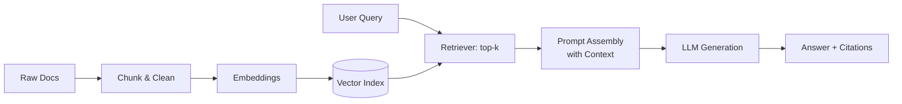

# Notes from Oracle LiveLabs: Building RAG Applications

> Personal notes and learnings from following Oracle LiveLabs workshops on Retrieval-Augmented Generation (RAG).  
> **No workshop code is included.** These are reflections and debugging logs.

---

## 📌 Why This Repo?
This repository was created to:
- Document learnings around building RAG applications while following Oracle LiveLabs workshops.
- Share the technologies used.
- Record challenges, debugging steps, and lessons learned.
- Provide a quick reference for anyone exploring RAG.

---

## 🔍 What is RAG?
**Retrieval-Augmented Generation (RAG)** combines:
- A **retriever**: fetches relevant context from your data.
- A **generator**: an LLM that uses this context to produce grounded answers.

**Typical RAG pipeline:**
1. **Ingest** → Chunk documents, clean text, compute embeddings.
2. **Index** → Store vectors in a vector database.
3. **Retrieve** → Find top-k relevant chunks by similarity/hybrid search.
4. **Augment** → Insert retrieved context into the prompt.
5. **Generate** → LLM answers, ideally with citations.
6. **Evaluate** → Measure retrieval quality, faithfulness, latency, and cost.

---

## 🛠 Tech Stack (Used in Setup)
- **Cloud Platform**: Oracle Cloud Infrastructure (OCI)
- **Vector Store**: Oracle Database 23ai
- **Embeddings Model**: all-MiniLM-L12-v2
- **LLM**: Cohere Command R+ 08-2024
- **Front End**: Oracle APEX

---

## 🏗 Architecture (High-Level)

---

## ⚠️ Challenges & Debugging Log
> A rolling log of issues, root causes, and fixes.

### LiveLab: RAG example with Oracle AI Vector Search

**Error Message: ORA-20401: Authorization Failed for URI**  
- **Symptom:** DBMS_CLOUD package cannot access object storage.
- **Root Cause:** Two possible causes, user authorisation is invalid or user authorisation is valid but cannot access the bucket.
- **Fix:** In the case experienced here, user authorisation was invalid, and the fix was to replace the username with your email address when creating the web credential:
  
    BEGIN
          DBMS_CLOUD.CREATE_CREDENTIAL(
            credential_name => 'OBJS_CREDENTIAL',
            username => 'your_email@emailprovider.com',
            password=> 'your_gen_token'
        );
      END;
      /

**Error Message: ORA-20404: Object not found**  
- **Symptom:** Unable to upload documents via APEX application to be stored in Object Storage bucket.
- **Root Cause:** Incorrect guidance in LiveLab of string to be passed as 'TENANCY_NAME'.
- **Fix:** Replace value for 'TENANCY_NAME' with Object Storage namespace.
- **Notes:** The LiveLab asks you to use save your tenancy name as displayed on your Oracle Cloud home page here:
  
  

  However, the actual value for the parameter 'TENANCY_NAME' in the application code should be the Object Storage namespace. This was discovered by debugging the application code and finding out how the parameter was being used:

  

---

## ✅ Lessons Learned
- LiveLabs aren't flawless, but provide good hands on experience in using some of the latest cloud technology that Oracle has to offer, including their Generative AI services.
- You may need to debug application code as you follow a lab and lab specific help isn't the easiest to find across the internet.

---

## 📚 References

- Oracle LiveLabs

---

## 👥 Authors

- **4Khan & FunmiLS** 

