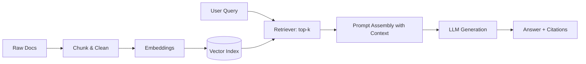

# Notes from Oracle LiveLabs: Building RAG Applications

> Personal notes and learnings from following Oracle LiveLabs workshops on Retrieval-Augmented Generation (RAG).  
> **No workshop code is included.** These are our reflections, evaluations, and debugging logs.

---

## 📌 Why This Repo?
We created this repository to:
- Document what we learned about RAG while following Oracle LiveLabs workshops.
- Share the technologies we used and why.
- Record challenges, debugging steps, and lessons learned.
- Provide a quick reference for anyone exploring RAG.

---

## 🔍 What is RAG?
**Retrieval-Augmented Generation (RAG)** combines:
- A **retriever**: fetches relevant context from your data.
- A **generator**: an LLM that uses this context to produce grounded answers.

**Typical RAG pipeline:**
1. **Ingest** → Chunk documents, clean text, compute embeddings.
2. **Index** → Store vectors in a vector database.
3. **Retrieve** → Find top-k relevant chunks by similarity/hybrid search.
4. **Augment** → Insert retrieved context into the prompt.
5. **Generate** → LLM answers, ideally with citations.
6. **Evaluate** → Measure retrieval quality, faithfulness, latency, and cost.

---

## 🛠 Tech Stack (Used in Our Setup)
- **Cloud Platform**: Oracle Cloud Infrastructure (OCI)
- **Vector Store**: Oracle Database 23ai
- **Embeddings Model**: [fill in]
- **LLM**: [fill in]
- **Front End**: Oracle APEX

---

## 🏗 Architecture (High-Level)

---

## 👥 Authors

- **4Khan & FunmiLS** 

